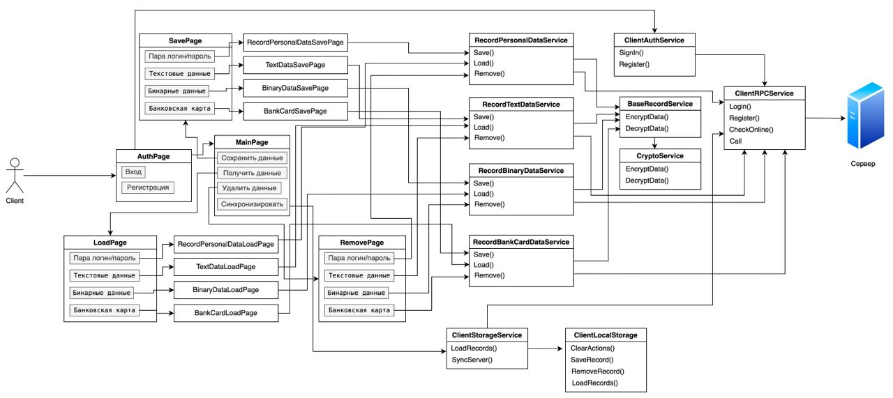

# GophKeeper

Взаимодействие между клиентом и сервером осуществляется через удаленный вызов процедур (RPC). 
Так как клиент и сервер написан на GO, то данные можно передавать через `encoding/gob`. 

Клиент для GophKeeper предоставляется в виде CLI-приложении с возможностью запуска на платформах Windows, Linux и Mac OS.
Также поддерживается терминальный интерфейс (TUI — terminal user interface).

## Схема взаимодействия c клиентом

1. Пользователь получает клиент под необходимую ему платформу.
2. Пользователь вводит логин и пароль и через tab выбирает "Вход" или "Регистрация". После чего уходит запрос на сервер
и при успешной ответе получаем токен авторизации.
3. Далее выбираем действие с записями "Удалить запись", "Добавить запись", "Получить запись".
4. После этого выбираем тип записи, которую ходим сохранить
5. Вводим параметры и удаляем/добавляем/получаем данные.

## Схема взаимодействия c сервером

1. Пользователь регистрируется в приложении. После успешной регистрации создается файл типа `gkdb`, где имя файла 
является хешом имени пользователя. Описание структуры файла `.gkdb` ниже.
2. Далее с каждым запросом передается токен, который парсится и извлекается из него username пользователя. По этому username
находится файл типа `gkdb` и возвращается клиент. Пароль в БД хранится в хешированном виде с солью.
3. После этого пользователь получает/сохраняет/удаляет запись.

## Выбор хранилища и формат хранения данных
В качестве базы данных используются файлы типо `.gkdb`. Название файла генерируется из хеша имени пользователя.

Структура базы данных состоит из 3 частей:
1. Подпись (не зашифровано)
2. Заголовок (не зашифровано)
3. Данные (зашифровано)

### Подпись

#### BaseSignature (4 байта)
Первая подпись говорит о том, что данный файл является базой данных GophKeeper.

* 0x9555123

#### VersionSignature (2 байта)
Вторая подпись указывает на версию GophKeeper.

* 0x01 - GophKeeper 1.x (файл .gkdb)

### Заголовок
После подписи базы данных начинается заголовок.

1. Flags (2 байта): Данное поле говорит о том, какие виды шифрования использовались при создании файла:

   * 0x01 - AES256

### Данные

В качестве мастер ключа используется приватный ключ сервера. 

## Механизм аутентификации пользователя и авторизации доступа к информации
Для регистрации и авторизации используется пара логин и пароль. Хеш логина используется для создания имени файла.
Пароль хранится в зашифрованной базе в виде хеша. Пользователь может авторизоваться с любого клиента и ему будет выдан
токен. Когда токен протухает, то необходимо авторизоваться заного.

Приложение использует JWT для проверки аунтентификации пользователя. В теле JWT хранится username пользователя. 

## Протокол взаимодействия клиента и сервера
Между сервером и клиентом использовался протокол `rpc` и способ передачи данных `encoding/gob`.  

Для обмена данными используется SSL (X.509) сертификат. На данный момент он генерируется для localhost. И его скрипт генерации
находится: `cert/gen.sh`. Также можно для сервера и клиента указать другой путь для сертификатов.

На клиенте данные шифруются используя алгоритм `AES-256-GCM`. В качестве мастер ключа используется пароль пользователя.
На сервер отправляются зашифрованные данные клиентом.

## Типы данных
GophKeeper позволяет хранить следующие типы данных:

* Текстовые данные:
  * Ключ для записи
  * Произвольное текстовое поле
  * Примечание к записи
* Персональные данные пользователя:
  * Ключ для записи
  * Имя пользователя
  * Пароль
  * Веб сайт, к которому принадлежит эта запись
  * Примечание к записи
* Бинарные данные:
  * Ключ для записи
  * Файл
  * Примечание к записи
* Банковская карта:
  * Ключ для записи
  * Номер карты
  * Год выпуска
  * CVV-код
  * Владелец карты
  * Примечание к записи

Данные на сервер отправляются в виде key-value: key - ключ для записи, value - зашифрованные данные записи.
Типы данных строго не определены и должны обрабатываться на клиенте.

Возможные операции с записью:
* Создание
* Редактирование
* Удаление

## Синхронизация данных
В случае, если сервер недоступен, то все сохраненные и удаленные записи сохраняются в отдельный файл. Далее после того,
как пользователь нажмет кнопку "сонхронизировать". То все ранее действия с записью попробуют выполниться повторно.

Авторизация в онлайн режими происходит идентично, за исключение того, что логин и пароль пользователя подходит любой и 
токен не будет выдан. Так как доступа до сервера нет, то регистрация также будет недоступна.
